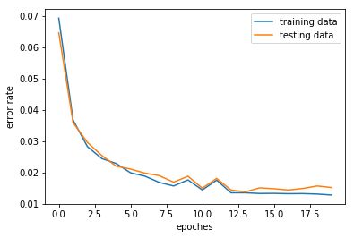
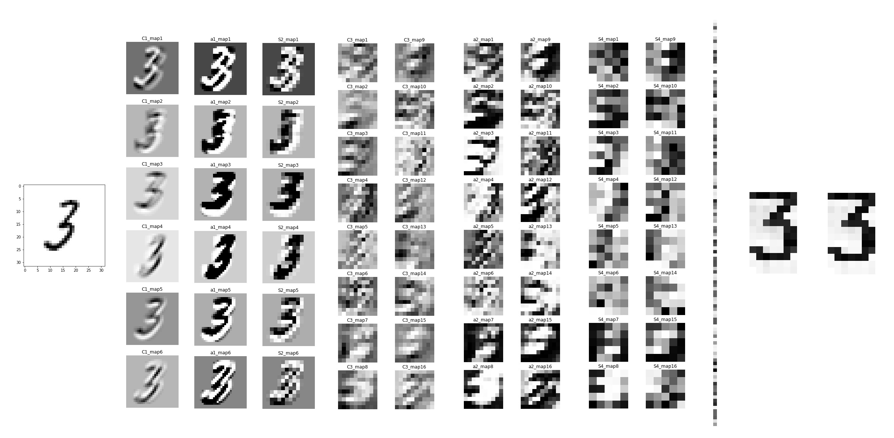
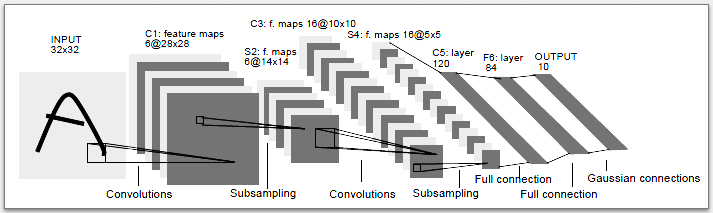

# LeNet5 Implementation FROM SCRATCH
This is an implementation of LeNet5 from [Yann LeCun's paper](http://yann.lecun.com/exdb/publis/pdf/lecun-98.pdf) in 1998, using Numpy & OOP only (without any auto-differentiate tools or deep learning frameworks).


## Why LeNet5

LeNet5 is the first ConvNet that using back propagation to update weights, acheived great success in hand writing recognition and utilized by AT&T for reading checks. Many believes that implementing LeNet5 is the best way to learning the programming of backprop for novice (like me). 

<a href="http://www.youtube.com/watch?feature=player_embedded&v=FwFduRA_L6Q
" target="_blank"></a>

## Result of Training 

Highest accuracy of 98.6% on MNIST testing dataset has achieved in 20 epoches of training (93.5% after 1st epoch). The training (20 epoches) takes about 3.5 hours using CPU.





## File Structure

```
LeNet5_from_scratch/
├── MNIST_auto_Download.py             # Python script for auto-download of MNIST dataset (MNIST folder)
├── LeNet5_train.ipynb                 # Notebook for training and shows the results
├── RBF_initial_weight.ipynb           # Notebook shows the fixed weight (ASCII bitmap) in the RBF layer
├── ExeSpeedTest.ipynb                 # Comparison of different version of Conv. & Pooling functions
├── Best_model.pkl                     # The model with 98.6% accuracy both on training and testing data
│
├── MNIST/                             # Folder contains MNIST training and testing data
│   ├── train-images-idx3-ubyte        # Training images
│   ├── train-labels-idx1-ubyte        # Training labels
│   ├── t10k-images-idx3-ubyte         # Testing images
│   └── t10k-labels-idx1-ubyte         # Testing labels
│
└── utils/                             # package
    ├── __init__.py 
    ├── Convolution_util.py            # Convolution forward and backward
    ├── Pooling_util.py                # Pooling forward and backward
    ├── Activation_util.py             # Activation functions
    ├── utils_func.py                  # Other functions like normalize(), initilize(), zero_pad(), etc
    ├── RBF_initial_weight.py          # Setting fixed weight (ASCII bitmap) in the RBF layer
    └── LayerObjects.py                # All the layer objects
```

## Structure of ConvNet

The original structure is:



The structure used here is much alike, but still have some differences:

1. Substitue the **sub-sampling** with **average pooling**, which is more accpetable choice without trainable parameters in the layer and needless to be followed by an activation funciton. I've tried using max-pooling, but it blurs the feature maps in this case and gave low accuracy.

2. I used **momentum optimizer** when updating the weights to accelerate the training process, which wasn't used in the original LeNet5. 


## Bug Alert

Stochastic Diagonal Levenberg-Marquaedt method is also used in this implementation to determine the learning rates for each trainable layer. However, my resulting range of learning rates is much smaller than the one given in the paper (maybe bugs exist in the SDLM code). Therefore, 100x original global learning rates are used.


## Reference

1. [Yann LeCun's paper](http://yann.lecun.com/exdb/publis/pdf/lecun-98.pdf)
2. [Marcel Wang's blog](http://hemingwang.blogspot.tw/search/label/_社團：技術：mAiLab)
1. [agjayant's repo](https://github.com/agjayant/CNN-Numpy)
2. [HiCraigChen's repo](https://github.com/HiCraigChen/LeNet)


## Todo list

1. Compare RBF layer with softmax layer (cross entropy) or simpy a FC layer
2. Accelerate with Cython or PyCuda
3. Try using sub-sampling layer

